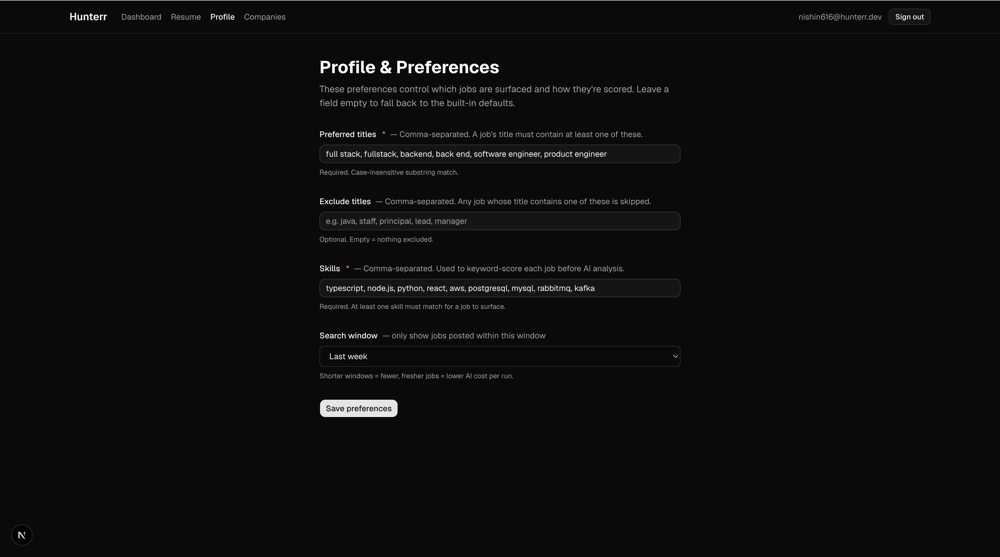
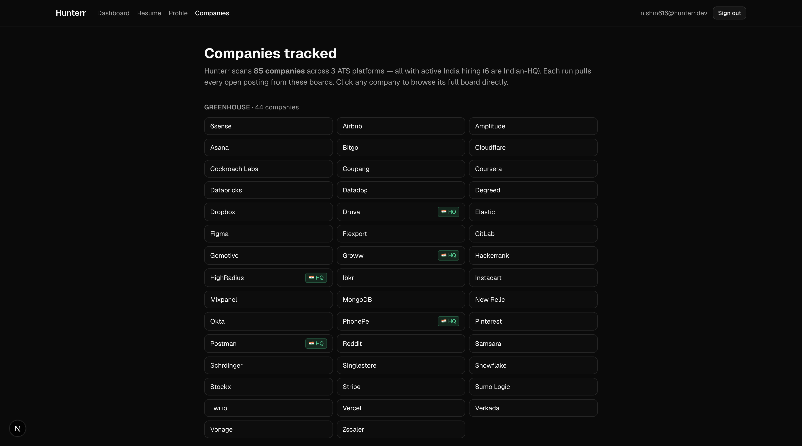

# Hunterr

An AI job-discovery agent. It scans 85 company job boards, filters roles by your
titles, skills, location and posting age, then sends each surviving job to Claude
alongside your resume for a structured fit analysis (score, verdict, strengths,
gaps). Results land in an auth-gated dashboard you can browse on desktop or phone.

Private alpha, invite only. There is no public signup; accounts are created from
the CLI by the admin.


## What it does

1. Crawl. Pulls every open posting from 85 companies across Greenhouse, Lever and
   Ashby in parallel (around 9,000 postings in a few seconds). No scraping, no
   auth, just the public ATS job-board APIs.
2. Filter. Narrows that down with your preferred titles, excluded titles, skill
   keywords, location and a posting-age window. Geofenced US/Canada "Remote"
   roles are auto-rejected. About 9,000 postings become roughly 30 worth scoring.
3. Score. Each surviving job description goes to Claude Sonnet 4.6 with your
   resume. It returns a structured verdict (strong / stretch / skip), a 1-10 fit
   score, concrete strengths, and gaps. Your resume is prompt-cached so a full
   run of 30 jobs costs roughly 10 cents.

The run streams its progress live (fetching, filtering, scoring N/30) so you can
watch the agent work instead of staring at a spinner.

## Screenshots

Live run progress, streamed stage by stage:


Per-user preferences (titles, skills, search window):



The 85 tracked companies, tagged by ATS and India-HQ:



## Stack

| Layer | Tech |
|-------|------|
| Framework | Next.js 16 (App Router, Turbopack) |
| Language | TypeScript 5 |
| UI | React 19, Tailwind CSS v4, shadcn/ui (Base UI primitives) |
| Auth | Auth.js v5 (Credentials provider, JWT sessions, bcryptjs) |
| Database | Neon Postgres, Drizzle ORM |
| AI | Anthropic SDK, Claude Sonnet 4.6 (prompt caching, structured outputs) |
| Data sources | Greenhouse, Lever, Ashby public job-board APIs |
| Resume parsing | pdf-parse, mammoth (PDF and DOCX) |
| Deploy | Vercel |

## Run locally

### Prerequisites

- Node.js 20 or newer (24 LTS recommended)
- npm 10 or newer
- A free Neon Postgres database (https://neon.tech)
- An Anthropic API key (https://console.anthropic.com)

### 1. Install

```bash
git clone <repo-url>
cd hunterr-web
npm install
```

### 2. Environment variables

Create `.env.local` at the project root:

```bash
DATABASE_URL=postgresql://...your-neon-connection-string...
AUTH_SECRET=<paste a 32-char random secret>
ANTHROPIC_API_KEY=sk-ant-...
```

Generate `AUTH_SECRET` with:

```bash
openssl rand -base64 32
```

### 3. Create the database schema

```bash
npm run db:push
```

This applies the Drizzle schema (the `users` table) to your Neon database.

### 4. Create a user

There is no signup page. Accounts are created from the CLI:

```bash
npm run create-user -- you@example.com yourpassword "Your Name"
```

Email is normalized to lowercase. The name argument is optional.

### 5. Run

```bash
npm run dev
```

Open http://localhost:3000, sign in, upload a resume on the Resume page, set your
titles and skills on the Profile page, then run a hunt from the Dashboard.

## Scripts

| Script | What it does |
|--------|--------------|
| `npm run dev` | Start the dev server (Turbopack) on port 3000 |
| `npm run build` | Production build |
| `npm run start` | Run the production build |
| `npm run lint` | ESLint |
| `npm run db:push` | Apply the Drizzle schema to the database |
| `npm run db:studio` | Open Drizzle Studio to inspect the database |
| `npm run create-user -- <email> <password> [name]` | Create a user account |
| `npm run discover -- <ats> <location>` | Find new company slugs with India jobs (see Company discovery) |
| `npm run migrate` | One-time SQLite-to-Postgres data migration (legacy) |

## How it works

Everything downstream of fetching operates on a single normalized `Job` shape, so
the pipeline does not care which board a job came from. Adding a source is just
writing a fetcher that returns `Job[]`.

- Fetchers (`src/lib/hunt/fetchers.ts`) hit each ATS API in parallel and normalize
  the responses.
- Filter (`src/lib/hunt/filter.ts`) applies title, exclude-title, location,
  posting-age and skill-keyword rules. Skill matching uses word boundaries so
  "java" does not match "javascript" but "node.js" does.
- Scoring (`src/lib/hunt/scoring.ts`) sends each job plus your resume to Claude.
  The resume sits in a prompt-cached system block, so only the first call pays
  full price for it. The response is constrained to a JSON schema and validated
  with Zod.
- The API route (`src/app/api/runs/route.ts`) streams progress events as
  newline-delimited JSON; the dashboard reads the stream and renders live status.

A hard cap of 30 jobs per run keeps the Claude spend bounded no matter how many
companies are tracked.

## Project structure

```
hunterr-web/
  drizzle.config.ts             Drizzle config (Postgres dialect)
  scripts/
    create-user.ts              CLI: create a user account
    discover.ts                 CLI: mine and validate new company slugs
    migrate-to-postgres.ts      One-time SQLite-to-Postgres migration
  public/
    screenshots/                Landing-page screenshots
  src/
    app/
      page.tsx                  Public landing page
      signin/                   Sign-in page, form, server action
      dashboard/                Dashboard, profile, resume, companies pages
      api/
        auth/[...nextauth]/     Auth.js endpoints
        runs/route.ts           Streaming hunt endpoint
    auth.config.ts              Edge-safe auth config (used by middleware)
    auth.ts                     Full auth config (DB lookup, bcrypt)
    middleware.ts               Route protection for /dashboard
    components/ui/              shadcn/ui components
    lib/
      db/                       Drizzle schema and Neon client
      hunt/                     config, fetchers, filter, scoring, pipeline
      resume/                   resume text extraction and AI profiling
```

## Auth

Auth.js v5 with the Credentials provider. The config is split in two:

- `src/auth.config.ts` is edge-safe with no database imports. The middleware uses
  it (middleware runs on the Edge runtime).
- `src/auth.ts` adds the `authorize` callback that hits the database. The route
  handler and server actions use it.

Sessions are JWT (no database round-trip per request). Passwords are hashed with
bcryptjs (pure JS, no native build). The invite-only contract is enforced by the
absence of a signup route: accounts only exist if an admin runs `create-user`.

## Company discovery

The 85 tracked companies were found by searching Google for the ATS pages
directly, for example:

```
site:jobs.lever.co "Bengaluru"
site:boards.greenhouse.io "Hyderabad"
```

The slug is in the result URL (jobs.lever.co/SLUG). Because you are searching the
ATS pages themselves, every hit is a real employer that uses that board and has a
matching posting. This avoids the staffing-agency noise that job aggregators
return.

The `discover` script automates the validation and population:

```bash
# Manual mode (no API key): validate slugs you found yourself
npm run discover -- lever --add Sprinto meesho fampay

# Search mode (needs Google Custom Search API keys in .env.local)
npm run discover -- lever bengaluru
```

It validates each slug against the live ATS API, keeps only ones with India jobs,
skips duplicates and 404s, and appends the rest to
`src/lib/hunt/discovered.json`, which merges into the curated list at runtime.

## Deployment

Hosted on Vercel with Neon Postgres. To deploy:

1. Push the repo to GitHub. `.env.local`, the database, and uploaded data are all
   gitignored, so no secrets are committed.
2. Import the repo into Vercel.
3. Set three environment variables in Vercel: `DATABASE_URL`, `AUTH_SECRET`,
   `ANTHROPIC_API_KEY`.
4. Deploy, then add a custom domain (point a CNAME at Vercel from your DNS host).

Note on serverless: a full run can take 60 to 90 seconds. The Vercel Hobby plan
caps functions at 60 seconds, so either upgrade to Pro (300 seconds) or lower the
per-run job cap.

## License

Personal project. Not open for contributions.

Built by Nishin S.
