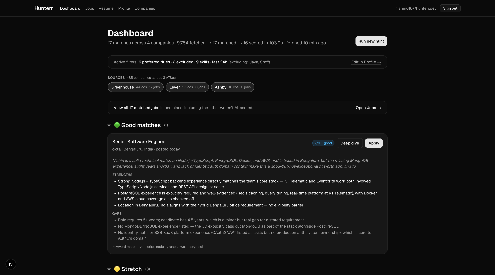
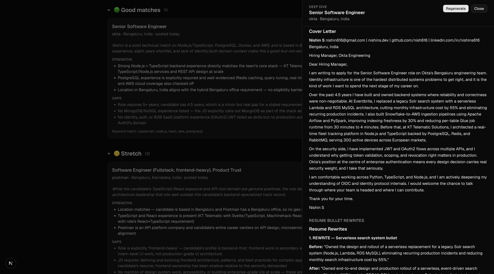
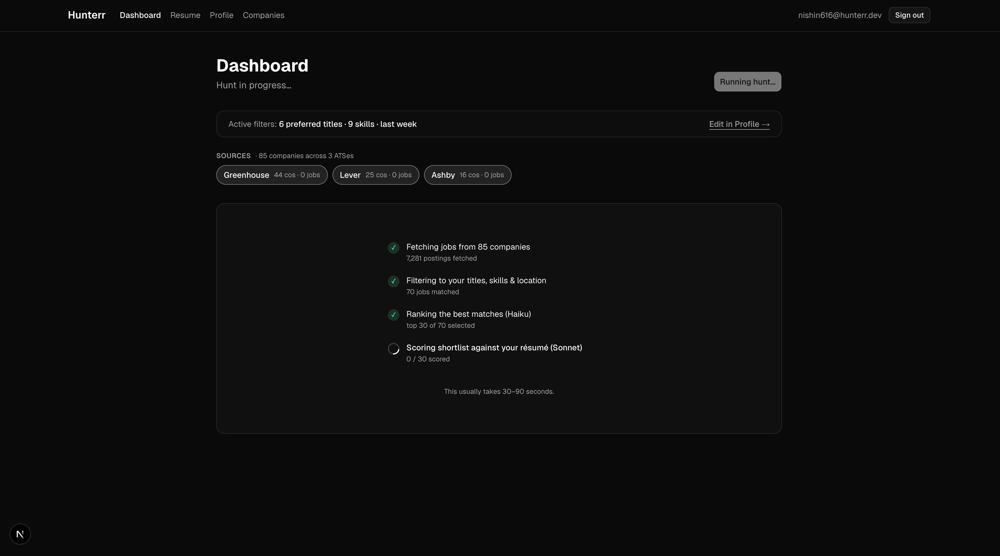

# Hunterr

An invite-only job-discovery system that combines an **AI workflow** for bulk
crawling/scoring with an **agentic** deep dive for high-touch per-job analysis.
Scans 86 company job boards, scores them against your resume, and on demand
runs a Claude agent that researches the company, gap-analyses you against the
JD, rewrites your resume bullets to fit, and drafts both a tailored cover
letter and interview-prep questions.



## AI workflow + agent

Two AI surfaces, each chosen for what it's actually good at.

**Bulk pipeline — an AI workflow** (fixed steps, deterministic order, cheap and fast):

1. **Crawl** — public Greenhouse, Lever, and Ashby APIs in parallel. ~9,000 postings in a few seconds.
2. **Filter** — title, exclude-title, location, posting-age, skill keywords. Word-boundary matching.
3. **Triage (LLM step)** — one Claude Haiku call ranks the matched pool down to the top 30 by seniority + skill fit.
4. **Score (LLM step)** — each of the 30 goes to Claude Sonnet with your resume prompt-cached. Returns a verdict (strong / good / stretch / skip), 1–10 score, strengths, gaps. ~$0.20–0.50 per run.

**Per-job deep dive — an agent** (Claude in a tool-use loop, choosing what to do next):

Click *Deep dive* on any scored job. The agent has two tools — `fetch_url` and
`save_finding` — and runs up to 10 turns to produce up to four grounded sections:

- **Company brief** — what they do, stage/funding, leadership, red flags. Skipped when the JD alone doesn't carry enough signal (no web-search tool).
- **Deep gap analysis** — concrete overlaps and gaps between your resume and the JD, citing exact phrases from both.
- **Tailored cover letter** — ~250 words, specific, no platitudes; references your linked GitHub/portfolio when relevant.
- **Resume bullet rewrites** — which bullets to emphasize, reword, or *add* (when the candidate has clear evidence of a JD-required skill that isn't on the resume yet), in before/after form.

The agent decides which sections to attempt based on what its tools surface
and skips any section it can't ground in fact rather than fabricating. Hard
caps on fetches and iterations keep spend at ~$0.25 per dive. Results stream
live into the dashboard and persist per-job in Postgres, so reopening the
panel shows the prior dive without re-running.



The split: predictable, low-cost bulk discovery; high-touch per-job depth on
demand.



## Stack

| Layer | Tech |
|-------|------|
| Framework | Next.js 16 (App Router, Turbopack) |
| Language | TypeScript 5, React 19 |
| UI | Tailwind CSS v4, shadcn/ui (Base UI primitives) |
| Auth | Auth.js v5 (Credentials, JWT, bcryptjs) |
| Database | Neon Postgres + Drizzle ORM |
| AI | Anthropic SDK — Claude Haiku 4.5 (triage), Sonnet 4.6 (scoring + deep-dive agent) |
| Sources | Greenhouse, Lever, Ashby public job-board APIs |
| Deploy | Vercel |

## Run locally

Prerequisites: Node 20+, a Neon Postgres URL, an Anthropic API key.

```bash
git clone <repo-url>
cd hunterr-web
npm install
```

Create `.env.local`:

```bash
DATABASE_URL=postgresql://...your-neon-connection-string...
AUTH_SECRET=<openssl rand -base64 32>
ANTHROPIC_API_KEY=sk-ant-...
```

Then:

```bash
npm run db:push                              # apply Drizzle schema
npm run create-user -- you@example.com pw   # invite-only; no signup page
npm run dev
```

Sign in, upload a résumé on the Résumé page, set titles/skills/links on
Profile, then run a hunt from the Dashboard.

## Scripts

| Script | Purpose |
|--------|---------|
| `npm run dev` | Dev server (Turbopack) |
| `npm run build` / `start` | Production build / run |
| `npm run lint` | ESLint |
| `npm run db:push` / `db:studio` | Apply schema / open Drizzle Studio |
| `npm run create-user -- <email> <password> [name]` | Create a user |
| `npm run discover -- <ats> <location>` | Discover new company slugs |

## Project layout

```
src/
  app/
    api/runs/                  Streaming hunt endpoint (AI workflow)
    api/jobs/deep-dive/        Streaming deep-dive endpoint (agent)
    dashboard/                 Dashboard, jobs, profile, resume, companies
  lib/
    hunt/                      Workflow: fetchers, filter, triage, score
    agent/                     Agent: tool-use loop, tools, event stream
    db/                        Drizzle schema and Neon client
```

## License

Personal project. Not open for contributions.

Built by Nishin S.
